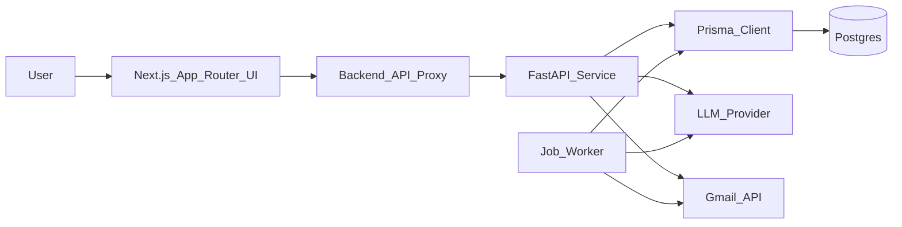

# ARCHITECTURE.md (AI Email Bot)

## Goals (from BRD + Wireframes)
- Lean internal tool: upload leads → generate personalized emails → review/edit → send via Gmail → track opens/replies → automate follow-ups (Day3/Day7) → hot-lead triage.
- Non-functional: 1K–5K leads/batch, retries + rate limiting, low-cost (< $50/mo), and **no sensitive credential storage**.

## Tech Stack Selection
- **Frontend**: Next.js 14 (App Router) + TypeScript + Tailwind CSS + Lucide React  
  Fits the wireframes’ multi-screen workflow, enables fast iteration, and aligns with workspace standards.
- **Backend**: Python FastAPI service (separate from Next.js)  
  Keeps AI + job processing isolated from the UI runtime and supports robust background processing patterns.
- **Database**: PostgreSQL + Prisma ORM  
  Required by workspace rules (**no raw SQL**) and supports reliable job/event tracking at low ops cost.
- **Validation**: Zod (frontend + shared request/response contracts) + Pydantic (backend)  
  Enables strict ingest validation (wireframe validation screen) and prevents schema drift.
- **AI Provider**: OpenAI or Anthropic SDK (provider-abstracted)  
  BRD allows either; we’ll define a stable interface so providers can be swapped without refactoring.
- **Email**: Gmail API (OAuth)  
  BRD “preferred for MVP”; wireframes require Gmail API status + OAuth settings screen.
- **Background jobs / scheduler**: Postgres-backed job queue (Prisma-managed tables) + worker process  
  Avoids Redis (cost/ops) while supporting follow-up scheduling, retries, and polling tasks.
- **Reply tracking**: Polling Gmail threads  
  Simpler than Pub/Sub push and sufficient for a “30-second daily check-in” monitor UX.

## High-Level System Diagram

## Step-by-Step Build Plan (Phased)

### Phase 0 — Foundations
- Repo scaffolding: Next.js app + FastAPI service + shared contract folder.
- Prisma + Postgres setup; baseline models.
- Env management (`.env.local`) and secrets handling policy (**no OAuth token persistence beyond session policy**).

### Phase 1 — Lead ingest + validation (Wireframe Screen 2)
- Lead import: Google Sheets link + CSV upload.
- Validation rules: required fields, email format, dedupe, optional fields.
- Persist lead batch (“campaign draft”) and validation errors for UI table.

### Phase 2 — Campaign setup (Screen 3)
- Campaign config: sender identity, tone, CTA type, follow-up toggles, throttle.
- Default inference: business type + location auto-detected from leads but editable.

### Phase 3 — AI email generation + explainability (Screen 4)
- Prompt templates: system prompt + variables (category, location, notes) + output schema.
- Generate per-lead draft with:
  - subject, body, CTA
  - “why this email” (explainability payload) persisted for trust UI
- Optional bulk-generate with concurrency limits.

### Phase 4 — Review/edit + approval gates (Screens 4–5)
- UI: sidebar lead list with status dots; main editor; approve all vs per-lead.
- Pre-send confirmation: summary of throttle, schedule, follow-ups, kill switch.

### Phase 5 — Sending engine (Screens 5–6)
- Gmail OAuth connect status + token refresh strategy.
- Rate-limited bulk send, retry policy, per-email status timeline.
- Live progress feed endpoint for UI.

### Phase 6 — Tracking + monitoring (Screens 7–9)
- Opens: tracking pixel endpoint; event capture (open_count + first_open_at).
- Replies: polling job that scans Gmail threads, links reply messages to leads.
- Lead qualification: Hot/Warm/Cold derivation.
- Monitor dashboards: KPI row, funnel counts, hot leads banner, export.
- Hot lead detail: thread view + AI-drafted response + activity timeline + next actions.

### Phase 7 — Settings + operational controls (Screen 10)
- Throttle slider, follow-up global toggles.
- Session security statement + token handling.

## Data Models (High-Level)

### Core Entities
- **Campaign**: grouping for a lead upload + configuration + lifecycle state.
- **Lead**: normalized person/company row + derived attributes (sector/location).
- **EmailDraft**: AI-generated subject/body + explainability + edited content + approval state.
- **EmailSend**: send attempt(s), Gmail message/thread ids, status, error codes.
- **EngagementEvent**: open/reply events with timestamps and metadata.
- **FollowUpPlan**: day offsets, enabled flags, per-lead due dates.
- **GmailConnection**: OAuth connection metadata (stored minimally; tokens handled per security policy).

### Suggested Status Enums (for UI tabs + dots)
- LeadStatus: `hot | warm | cold | interested | not_interested | no_response`
- DraftStatus: `generated | needs_review | approved | failed`
- SendStatus: `pending | sent | failed | retrying | paused`

### Validation Shapes (Interfaces / Schemas)
- LeadInput: required fields per BRD + optional notes/linkedin.
- CampaignConfig: tone, CTA type, throttle, follow-up toggles.
- DraftOutput: subject, body, cta, why.

## Key Architectural Notes / Constraints
- No raw SQL: all persistence via Prisma.
- No `any` in TypeScript: use explicit interfaces and Zod inference.
- Background processing is required (send, retries, follow-ups, reply polling).
- Authentication: BRD says multi-user/auth is out-of-scope; we will implement single-operator sessions + Gmail OAuth.

